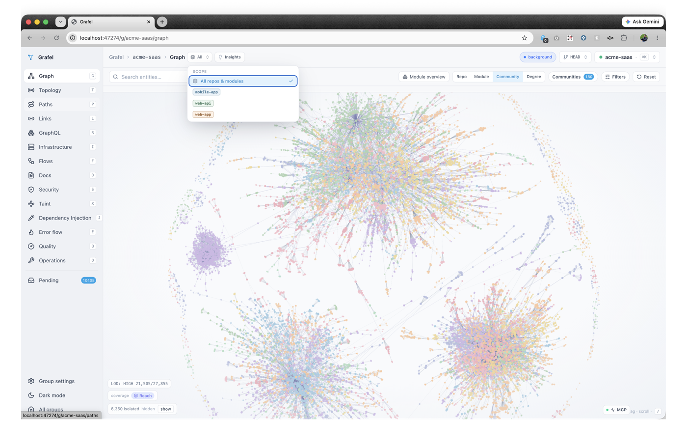

# grafel

> ## Map your codebase, navigate any part.
>
> *Where grep gets lost, the Grafel shows the way.*

**No cloud indexing, no account, no data sent anywhere.** Everything runs locally — the daemon indexes on your machine and never phones home.

[](https://github.com/cajasmota/grafel/actions/workflows/test.yml)
[](LICENSE)
[](CHANGELOG.md)

grafel is a local code-knowledge-graph daemon that gives AI agents structural navigation — call graphs, cross-repo dependency traces, HTTP surface maps, and process flows — across one or many repositories, exposed via 65 MCP tools.

**A companion to `grep`, not a replacement.** `grep` finds text; grafel maps structure — use them together. The standout value is **navigation**: where is `X` defined, who calls `Y`, how a request flows end-to-end, the blast radius of a change. Those are the questions grep can't answer and the graph can. (Fewer file reads also means fewer tokens — a nice side effect, not the point.)

---

## Why grafel

AI coding agents are good at reading files. They are not good at navigating relationships between files — especially across multiple repositories. Ask an agent "what calls `PaymentService.charge`?" and it will grep, guess, and sometimes hallucinate. Ask it to trace a request from the mobile app through the API gateway to the database — across three repos — and it will read dozens of files it doesn't need.

grafel pre-builds the relationship map. It indexes your codebase into an in-memory graph (entities, call edges, import edges, HTTP routes, message-bus topics) and keeps it fresh via file watchers. When an agent asks a structural question, it gets a precise answer in one round-trip instead of twenty file reads.

The graph lives entirely on your machine — local-first by design, as called out above. One binary, one daemon process, one port.

---

## What you get

- **Call graph navigation** — find every caller of a function, walk dependency chains, trace paths between any two entities. Works across repos in a single query.
- **HTTP surface mapping** — enumerate every route definition and every call-site that references it; surface orphan callers (client calls with no matching server handler) without manually auditing both sides.
- **Process flow tracing** — pre-computed BFS from entry points (route handlers, `main`, framework hooks) stored as traceable chains; ad-hoc follow from any entity on demand.
- **Message-bus topology** — topic/broker/service groupings for event-driven systems; publisher and subscriber orphan detection.
- **Cross-repo dependency graph** — index a folder of repos as one group; edges span repo boundaries with confidence scores; diff graph state between any two indexed refs.
- **Documentation and analysis skills** — a 15-skill family (tech docs, business docs, security audit, consultant panel, patterns) all driven off the graph, invokable from Claude Code as slash commands.
- **Real-time dashboard** — 19 surfaces (Graph, Flows, Event-flows, Topology, Paths, Links, GraphQL, IaC, Docs, Security, Taint, DI, Error-flow, Quality, Settings, Pending, Operations, Compare, Missing) embedded in the daemon, no separate server, at `http://127.0.0.1:47274`.

---

## Dashboard

grafel ships a local web dashboard: an in-browser view of your code knowledge graph. It is served by the daemon at `http://127.0.0.1:47274/` and opened with `grafel dashboard` (which auto-starts the daemon if it isn't already running). Everything runs on your machine — the dashboard reads the same in-memory graph the MCP server does, with no cloud, no upload, and no account. Same local-first posture as the rest of grafel: your code never leaves your laptop.

<!-- TODO: add screenshot — drop the PNG at docs/images/dashboard-graph.png -->


### Key views

The left rail switches between per-project screens:

- **Graph** — the hero surface: a GPU-accelerated, force-directed visualization of the whole knowledge graph (cosmos.gl), with search, community/cluster grouping, module analysis, color modes, and filters. A live MCP-activity overlay glows the nodes your agent touches in real time, with a replayable query log.
- **Topology** — async message-channel map for event-driven systems: topics, brokers, services, and publisher/subscriber relationships.
- **Paths** — API & endpoint explorer: every HTTP route and its definition, callers, downstream flow, parameters, response shapes, and auth posture. The downstream-flow modal can flip from a call tree to a per-function **control-flow flowchart** (React Flow + elkjs layout) for the endpoint's handler.
- **Flows** — process-flow explorer: layered DAGs per flow, multi-service traces, saga forward/compensation paths, plus dead-end and truncated-flow views.
- **Links** — cross-repo links between entities that span repository boundaries.
- **GraphQL** / **Infrastructure (IaC)** — GraphQL schema surface and infrastructure-as-code resource diagrams.
- **Docs** — generated documentation (from the `/grafel-tech-docs` and `/grafel-business-docs` skills) rendered in-app.
- **Security** / **Taint** / **DI** / **Error flow** — security findings, taint paths, dependency-injection wiring, and error/exception flow.
- **Quality** — graph-health surface: orphan audit and recall measurement.
- **Operations** — daemon control, logs, learned-patterns store, and update checks.
- **Pending** — residual-edge and repair suggestions awaiting review.
- **Settings** — per-group management (repos, watchers/git-hooks, docs path, health check) and the **AI coding tools** panel: a checklist to pick which tools grafel installs its MCP entry and rules files into. Changes apply instantly, daemon-up, across every repo in the group.

<!-- TODO: add screenshot — drop the PNG at docs/images/dashboard-flows.png -->


<!-- TODO: add screenshot — drop the PNG at docs/images/dashboard-tools-settings.png -->


> The screenshots above are placeholders. Drop the PNGs into [`docs/images/`](docs/images/) to make them render.

---

## How it works

grafel runs as a background daemon. The daemon manages a tree-sitter-based indexer (50+ languages), an in-memory graph loaded from `.grafel/graph.fb` per repo, an MCP server on stdio, live file watchers, and the embedded dashboard — all as one process.

```
your repos
    |
    v  grafel index (tree-sitter + resolver)
 .grafel/graph.fb   <-- per-repo binary graph snapshot
    |
    v  daemon (in-memory, mtime-driven reload)
 MCP server (stdio) -- AI agent (Claude Code, Cursor, Windsurf, ...)
 Dashboard (HTTP)   -- browser at http://127.0.0.1:47274
```

When an agent calls `grafel_find(query="payment processing")`, the daemon runs BM25 against entity labels and qualified names, then expands outward via BFS — returning a ranked, token-budgeted subgraph in one call. No files are read at query time.

After `grafel install`, the daemon registers itself as an MCP server in your Claude Code config automatically. No manual JSON editing.

---

## Quickstart

Install with one line. On macOS / Linux:

```sh
curl -fsSL https://raw.githubusercontent.com/cajasmota/grafel/main/install.sh | bash
```

On Windows (PowerShell):

```powershell
irm https://raw.githubusercontent.com/cajasmota/grafel/main/install.ps1 | iex
```

Then point it at your code and wire it up:

```sh
# 1. Point it at your code (interactive)
grafel wizard

# 2. Start the daemon + register MCP + install skills
grafel install

# 3. Confirm everything is wired
grafel status

# 4. Open the dashboard
grafel dashboard
```

The dashboard is at `http://127.0.0.1:47274`. Your AI agent picks up the MCP server automatically after the next session restart.

Prefer to build from source? See [docs/install.md](docs/install.md) for the full install matrix (source build, manual binary download, dev mode).

To verify from inside Claude Code:
```
grafel_whoami()
grafel_stats()
grafel_clusters()
```

For per-agent setup instructions see [docs/agent-hosts.md](docs/agent-hosts.md).

---

## When you'd reach for it

**Onboarding to an unfamiliar codebase** — run `grafel wizard`, index, then ask your agent to orient you with `grafel_clusters` and `grafel_traces`. You get a module map and top-level flows in minutes instead of hours.

**Doing a code review and want to know the blast radius** — `grafel_expand` from the changed entity shows every caller and downstream dependency. The `/grafel-aware-review` skill surfaces this automatically during review.

**Generating documentation** — `/grafel-tech-docs` produces per-module READMEs, API reference, cross-cutting concerns, and a group synthesis. `/grafel-business-docs` produces PM-facing capability descriptions and user journeys from the same graph.

**Auditing security** — `/grafel-security-audit` runs deterministic static checks (auth coverage, reachability, orphan endpoints, PII exposure paths) then an LLM confirmation pass.

**Working across a monorepo or multi-repo group** — grafel cross-links repos in a group and resolves edges across repo boundaries, so `grafel_trace(source="mobile-app::UICheckout", target="payments-api::ChargeHandler")` works even though those entities live in different repositories.

---

## What's inside

| Resource | Contents |
|----------|----------|
| [docs/README.md](docs/README.md) | Documentation index |
| [docs/quickstart.md](docs/quickstart.md) | Install + first index + first query |
| [docs/concepts.md](docs/concepts.md) | Knowledge graph, entities, edges, residual edges, repair |
| [docs/mcp-tools.md](docs/mcp-tools.md) | MCP tool catalogue and pointer to full schema |
| [docs/install.md](docs/install.md) | Full install matrix (script, binary, source, dev mode) |
| [docs/tools.md](docs/tools.md) | Supported AI coding tools matrix + per-tool enable/disable (CLI + web) |
| [docs/setup-per-tool.md](docs/setup-per-tool.md) | Step-by-step "set up grafel in my tool" guide (Claude Code, Codex, Cursor, Windsurf, Kiro, Antigravity, Codeium, Copilot) |
| [docs/agent-hosts.md](docs/agent-hosts.md) | Per-agent setup (Claude Code, Cursor, Windsurf, Continue, Aider, Cline) |
| [skills/README.md](skills/README.md) | Skill family — chains, dependencies, install |
| [internal/mcp/SCHEMA.md](internal/mcp/SCHEMA.md) | Full MCP tool schema (canonical) |
| [CHANGELOG.md](CHANGELOG.md) | Version history and breaking changes |
| [CLAUDE.md](CLAUDE.md) | When to use MCP vs grep (agent pairing guide) |

---

## Languages

Core extractors for 50+ languages including Go, Python, TypeScript/JavaScript, Java, C#, C++, Rust, Ruby, PHP, Swift, Kotlin, Scala, Dart, Elixir, and more. Infrastructure: Terraform/HCL, Solidity, Verilog/SystemVerilog. Frontend: Vue SFC, Svelte, Astro. Cross-cutting: SQL, GraphQL, Protocol Buffers, Dockerfile.

Each extractor emits language-specific edges (HTTP endpoints, ORM queries, dynamic dispatch, framework hooks).

### Coverage

grafel tracks **39 languages (25 active), 255 frameworks, 176 ORMs, 129 tools, and 205 other** capabilities, plus cross-cutting infrastructure: databases, platform/k8s, message brokers, CI/CD, security, observability, protocols, and build systems.

Top languages by framework support:

| Language | Frameworks | ORMs | Tools |
|----------|-----------:|-----:|------:|
| JS/TS | 33 | 19 | 21 |
| C/C++ | 25 | 10 | 16 |
| python | 25 | 18 | 15 |
| java | 23 | 15 | 10 |
| go | 21 | 17 | 8 |
| C# | 18 | 16 | 7 |
| kotlin | 18 | 7 | 0 |
| rust | 17 | 15 | 10 |

See the [full coverage matrix](docs/coverage/summary.md) for every language and the complete cross-cutting infrastructure tables. Per-language detail lives in [docs/coverage/by-language/](docs/coverage/by-language/); per-category detail in [docs/coverage/by-category/](docs/coverage/by-category/).

---

## Status

Preview (v0.x). Approaching v1.0. APIs, MCP tool names, and graph schema may change between minor versions. macOS is the primary supported platform; Linux is tested; Windows works via MinGW build.

See [CHANGELOG.md](CHANGELOG.md) for breaking changes.
Track the v1.0 milestone: https://github.com/cajasmota/grafel/milestone/1

### v1.0 ship-gate

- [ ] Bug-rate below 10% on the full validation corpus
- [ ] Daemon determinism (#481) resolved
- [ ] HTTP overhaul — unified HTTP client/server pairing
- [ ] Per-language quality pass (residual orphan elimination)

---

## Contributing

See [CONTRIBUTING.md](CONTRIBUTING.md). If you're an AI agent contributing to grafel, see [AGENTS.md](AGENTS.md) for conventions.

---

## License

MIT — see [LICENSE](LICENSE).
